<div align="center">

<picture>
  <source media="(prefers-color-scheme: dark)" srcset="dark.svg">
  <source media="(prefers-color-scheme: light)" srcset="light.svg">
  
</picture>

<br/>


<br/><br/>


</div>

<br/>

## `$ whoami --professional`

```
> Computer Science & Engineering graduate passionate about front-end development
> Currently building clean, responsive, user-friendly interfaces with React.js
> Strengthening skills in JavaScript, SQL, and modern front-end workflows
> Goal: Grow into a strong full-stack developer
> Open to front-end / web development collaboration opportunities
```

<br/>

<table align="center">
<tr>
<td>

**LOCATION**

</td>
<td>Coimbatore, Tamil Nadu, India</td>
</tr>
<tr>
<td>

**FOCUS**

</td>
<td>Front-End Dev &amp; Responsive UI</td>
</tr>
<tr>
<td>

**GITHUB**

</td>
<td><a href="https://github.com/Dhinabharani">github.com/Dhinabharani</a></td>
</tr>
<tr>
<td>

**LINKEDIN**

</td>
<td><a href="https://linkedin.com/in/dhinabharani">linkedin.com/in/dhinabharani</a></td>
</tr>
<tr>
<td>

**LEETCODE**

</td>
<td><a href="https://leetcode.com/u/Dhinabharani">leetcode.com/u/Dhinabharani</a></td>
</tr>
<tr>
<td>

**EMAIL**

</td>
<td><a href="mailto:dhinabharani8@gmail.com">dhinabharani8@gmail.com</a></td>
</tr>
</table>

<br/>

## `$ cat what-i-do.md`

- ✨ Build responsive, cross-browser web interfaces
- 🎨 Convert design mockups into pixel-perfect, user-friendly pages
- ⚡ Work with HTML5, CSS3, JavaScript &amp; Bootstrap
- 🗄️ Handle data with MySQL
- 🚀 Collaborate with teams to debug, optimize, and ship features

<br/>

## `$ ls skills/`

<div align="center">

**Frontend**


**Languages**


**Database**


**Tools**


</div>

<br/>

## `$ git log --experience`

<table>
<tr>
<td><b>Front-end Development Intern</b><br/>DreamsPlus Consulting Pvt. Ltd, Chennai</td>
<td align="right"><i>Aug 2024 – Sep 2024</i></td>
</tr>
<tr>
<td><b>Web Development, Company Placement</b><br/>Anand Techverce LLP, Chennai</td>
<td align="right"><i>Jan 2025 – May 2025</i></td>
</tr>
<tr>
<td><b>Web Development</b><br/>Webdoux, Chennai</td>
<td align="right"><i>Pursuing</i></td>
</tr>
</table>

<br/>

## `$ ls projects/ --featured`

<table>
<tr>
<td width="50%" valign="top">

**🛒 Intelligent Grocery Control System**

Smart inventory tracker that predicts shopping needs and flags expiring items.

`HTML` `CSS` `JavaScript` `Python` `Django` `MySQL`

</td>
<td width="50%" valign="top">

**🌐 Simple Web-page Creation**

A clean, responsive landing page built from scratch.

`HTML5` `CSS3` `JavaScript` `Bootstrap`

</td>
</tr>
</table>

<br/>

## `$ cat education.md`

- **B.E. Computer Science &amp; Engineering** — United Institute of Technology, Anna University *(2022 – 2025)*, CGPA 7.9
- **Diploma in Mechanical Engineering** — Najailingammal Polytechnic *(2020 – 2022)*, 92%

<br/>

## `$ ls certifications/`

- 🎓 Network Essentials — Naan Mudhalvan, CISCO
- 🏆 3rd Prize — International Conference on Technologies

<br/>

## `$ ./connect.sh`

<div align="center">

[](https://github.com/Dhinabharani)
[](https://linkedin.com/in/dhinabharani)
[](https://leetcode.com/u/Dhinabharani)
[](mailto:dhinabharani8@gmail.com)

</div>

<br/>

<div align="center">

⭐ From **Dhina Bharani** | Front-End &amp; React.js Developer

</div>
